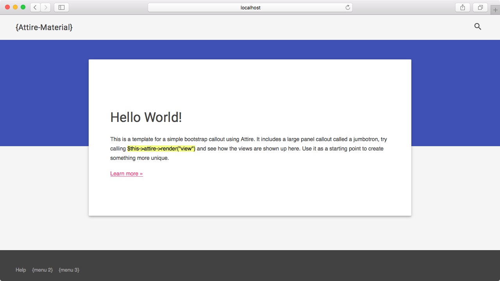
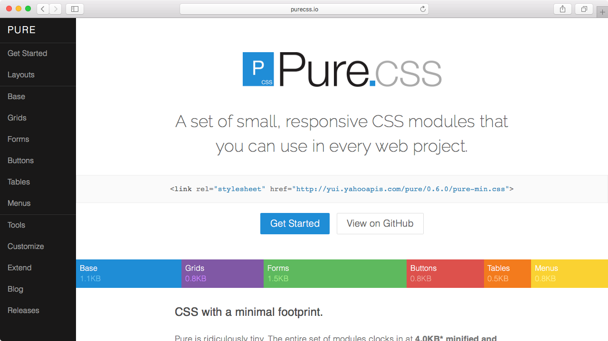

# Overview

**Attire** is a Codeigniter Driver for fast development and maintenance of structured templates, layouts and assets.

## Features

Build on top on great technology.

* **Solid Base**: Built with [Twig Engine](http://twig.sensiolabs.org/).
* **Highly Customizable**: Easily customize to work exactly how you want it to.
* **Extendable**: The template system allows you to build multiple themes and layouts.
* **Manageable**: Manage your assets, templates and layouts by taking care of preprocessors and dependencies.
* **Compressible**: Build with minification and caching extensions.
* **Secure**: Evaluate untrusted template code using a sandbox mode and output escaping.

## Templates

 |  | 
:------------: | :-------------: | :------------:
Twitter Bootstrap | Google Material Design | Yahoo Pure
