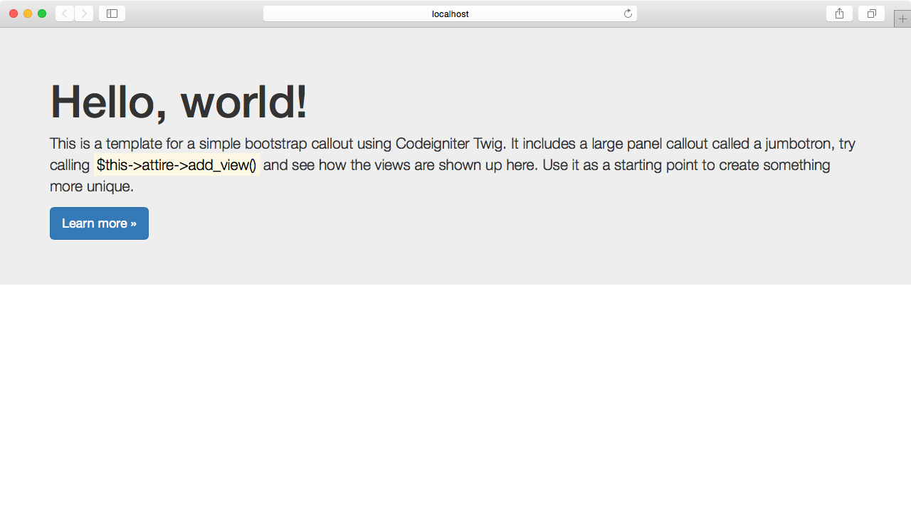

There are some available themes using different CSS Frameworks which are excellent start point for your next project. Here’s an example with the Bootstrap Framework.

First, install the new theme with composer:

    composer require attire/bootstrap-theme

Next open the config file `path/to/application/config/attire.php` and set the theme:

``` php
<?php
$config['theme'] = [
	'name'   => 'bootstrap',
	'layout' => 'jumbotron',
];
```

And finally load it with the `render()` method:

``` php
<?php defined('BASEPATH') OR exit('No direct script access allowed');

class Welcome extends CI_Controller
{
	public function index()
	{
		$this->load->library('attire');
		$this->attire->render();
	}
}
```

Refresh your browser to see the changes:



Also you can set a theme with the `setTheme` method as well:

``` php
<?php
class Welcome extends CI_Controller
{
	public function index()
	{
		$this->load->library('attire');
		$this->attire->setTheme('bootstrap')->setLayout('jumbotron');
		$this->attire->render();
	}
}
```

Now you can use the [Twitter Bootstrap](http://getbootstrap.com/) framework in your application.
